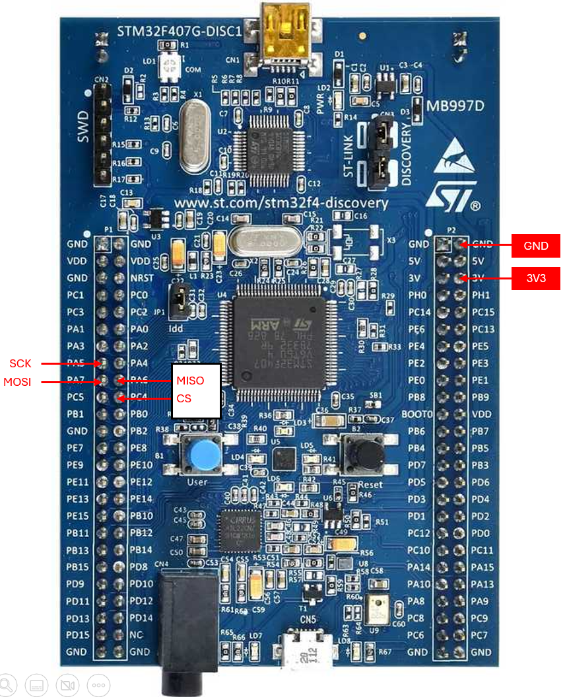
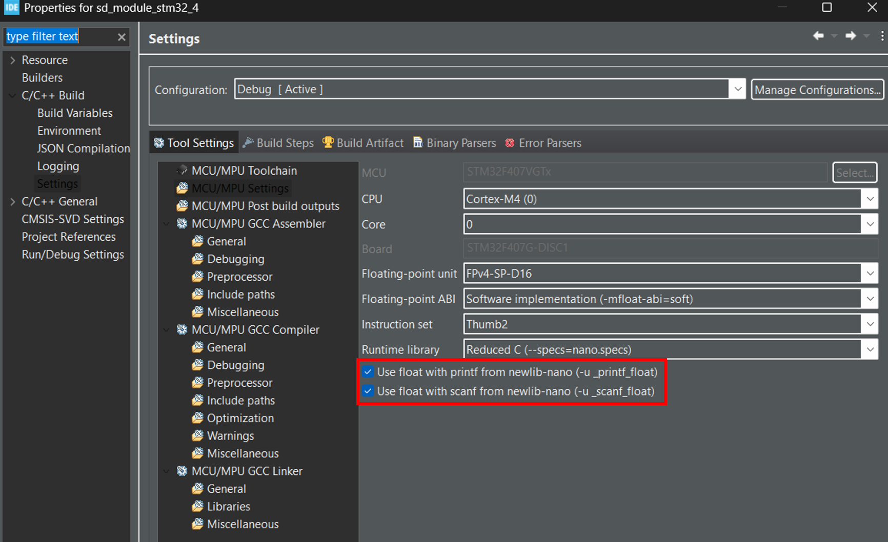
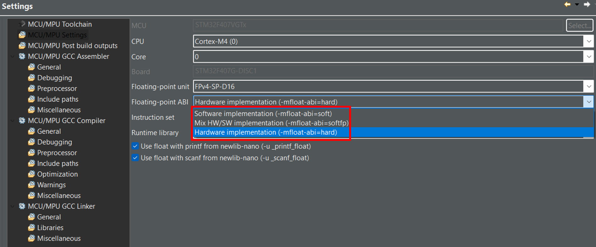
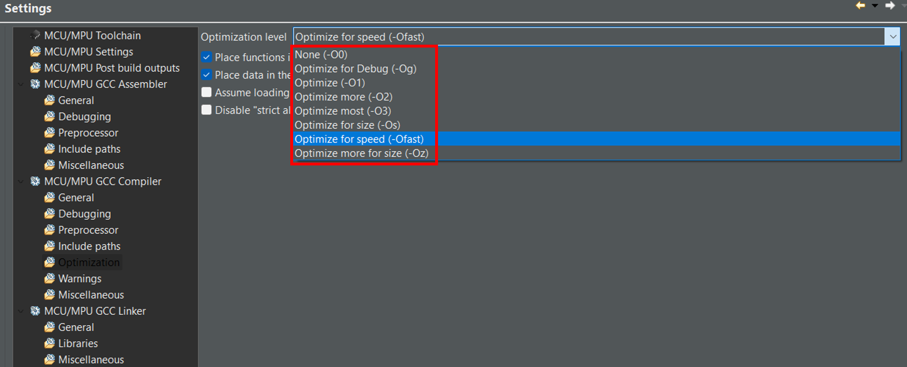
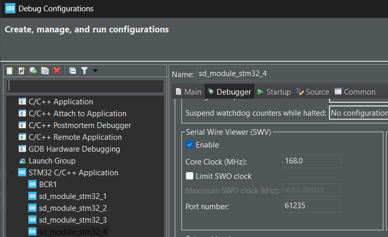
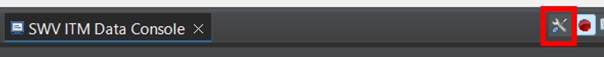
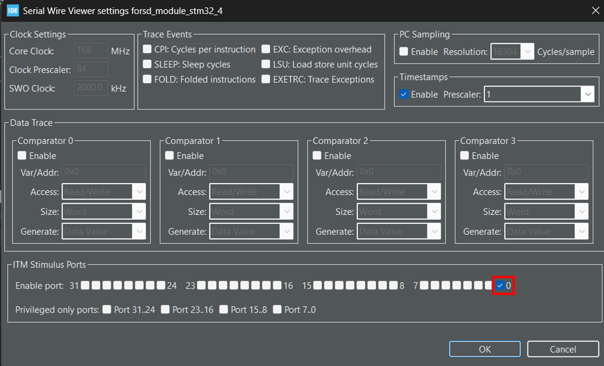
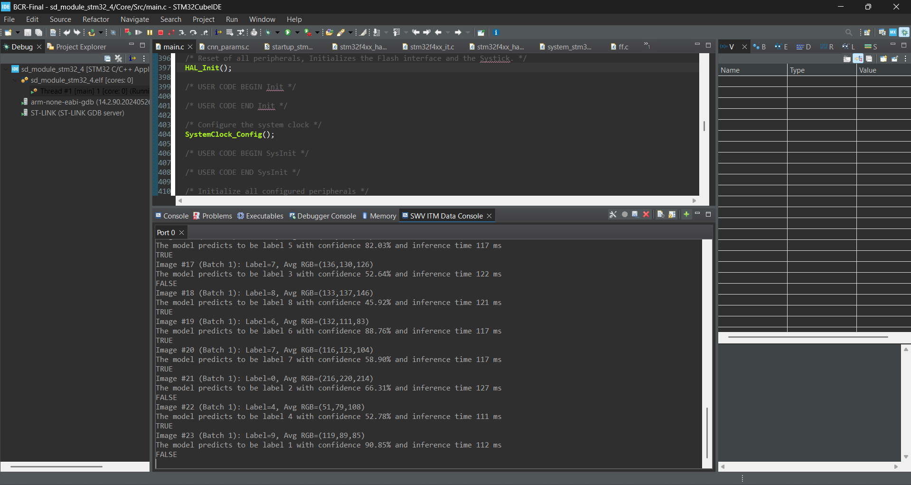
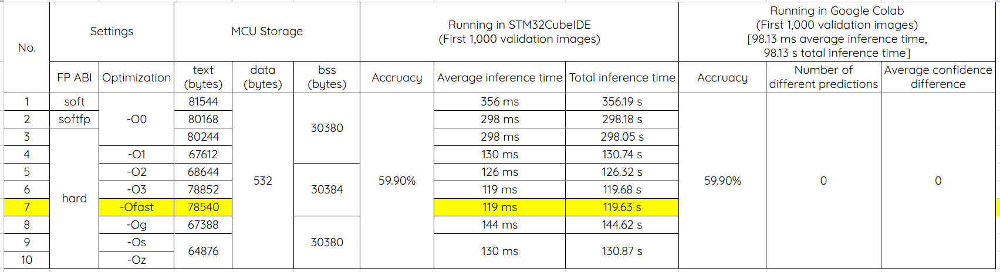

# Bachelor Project

## Introduction

My name is Cao Nguyễn Hoàng Hải 20213609. My project is using CNN model to test all the 10,000 validation images from CIFAR-10 dataset using STM32F4 Discovery. The results from STM32CubeIDE have been compared with the Google Colab version.

For Embedded C codes of SD Card Read/Write Module: https://blog.naver.com/PostView.naver?blogId=eziya76&logNo=221188701172

## Hardware Needed

1. STM32F4 Discovery Microcontroller
2. [SD Card Module](https://linhkienchatluong.vn/module-doc-the-nho/module-doc-the-sd-card_sp497_ct206.aspx)
3. [MicroSD Kingston Class 10 32GB](https://cellphones.com.vn/the-nho-microsd-kingston-class-10-non-adapter-32gb.html) with [Adapter](https://tuanphong.vn/adapter-the-nho/adapter-microsd-to-sd)

Note: The MicroSD must be in FAT32 format.

## Hardware Connection

This is the connection between STM32F4 Discovery and SD Card Module:



## Testing the First 1,000 Validation Images

**Step 1:** Run [cifar10_training_parameters_generated.ipynb](software_implementation/cifar10_training_parameters_generated.ipynb) (with Python 3 and T4 GPU) to generate [cnn_params.h](software_implementation/cnn_params.h) (trained weights for MCU) and [cifar10_cnn.weights.h5](software_implementation/cifar10_cnn.weights.h5) (trained weights for evaluation with Google Colab).

**Step 2:** Run [cifar10_validation_images_txt_generated.ipynb](software_implementation/cifar10_validation_images_txt_generated.ipynb) to generate 2 zip folders of [cifar10_essential](https://mega.nz/folder/wJJTwTJJ#zN7Oi0LQul-38wNOVVigYg) and [cifar10_full_dataset](https://mega.nz/folder/0VYwjYTR#EB6_onD29DyLSFZ92Z05Rg). Put all the cifar10_batch_1.txt, cifar10_batch_2.txt, ..., cifar10_batch_10.txt from [cifar10_essential](https://mega.nz/folder/wJJTwTJJ#zN7Oi0LQul-38wNOVVigYg) folder into the SD Card.

**Step 3:** Configure .ioc file in STM32CubeIDE:
- RCC: HSE to "Crystal/Ceramic Resonator".
- SYS: Debug to "Serial Wire".
- SPI1: Mode to "Full-Duplex Master".
- FATFS (User-defined): USE_LFN to "Enabled with static working buffer on the BSS"; MAX_SS to "4096".
- Set pin PC4 to GPIO_Output.
- In clock configuration, configure HCLK to a maximum of 168 MHz.

**Step 4:** Configure settings of the project: In "Properties" > "C/C++ Build" > "Settings" > "MCU/MPU Settings":



**Step 5:** After automatically generating codes when Ctrl+S the .ioc file:
- Adding [fatfs_sd.c](Core/Src/fatfs_sd.c) and [fatfs_sd.h](Core/Inc/fatfs_sd.h)
- Adding [cnn_params.h](Core/Inc/cnn_params.h) generated from [cifar10_training_parameters_generated.ipynb](software_implementation/cifar10_training_parameters_generated.ipynb) before and [cnn_params.c](Core/Src/cnn_params.c)
- In [stm32f4xx_it.c](Core/Src/stm32f4xx_it.c), adding codes at:
  + /* USER CODE BEGIN 0 */
  + void SysTick_Handler(void)
 - Configure "return" at [user_diskio.c](FATFS/Target/user_diskio.c) using functions in [fatfs_sd.h](Core/Inc/fatfs_sd.h)
 - In [syscalls.c](Core/Src/syscalls.c),
   + Adding these line codes https://github.com/niekiran/Embedded-C/blob/master/All_source_codes/target/itm_send_data.c
   + In _write function, change "__io_putchar(*ptr++);" to "ITM_SendChar(*ptr++);".
 - Configure [ff.c](Middlewares/Third_Party/FatFs/src/ff.c)
 - Configure the [main.c](Core/Src/main.c)
   + /* USER CODE BEGIN Includes */
   + /* USER CODE BEGIN PD */
   + /* USER CODE BEGIN PFP */
   + /* USER CODE BEGIN 0 */
   + /* USER CODE BEGIN 2 */
   + /* USER CODE BEGIN 3 */

**Step 6:** Choose Floating-point ABI options ("Properties" > "C/C++ Build" > "Settings" > "MCU/MPU Settings") & Optimization options ("Properties" > "C/C++ Build" > "Settings" > "MCU/MPU GCC Compiler" > "Optimization").





After that, "Clean Project" then "Build Project". The project should runs with no errors and no warnings. In "Debug Configurations" > "Debugger", enable the Serial Wire Viewer (SWV). 



Then, "Debug As STM32 C/C++ Application".

In the Debug Mode, at the "SWV ITM Data Console", click this:



Enable Port 0:



Then click this to track printf:


Finally, click "Resume":


The project finally runs like this:



After finishing running, copy the text at "SWV ITM Data Console" and paste in:
- [stm32_soft_O0_predictions.txt](software_implementation/stm32_soft_O0_predictions.txt)
- [stm32_softfp_O0_predictions.txt](software_implementation/stm32_softfp_O0_predictions.txt)
- [stm32_hard_O0_predictions.txt](software_implementation/stm32_hard_O0_predictions.txt)
- [stm32_hard_O1_predictions.txt](software_implementation/stm32_hard_O1_predictions.txt)
- [stm32_hard_O2_predictions.txt](software_implementation/stm32_hard_O2_predictions.txt)
- [stm32_hard_O3_predictions.txt](software_implementation/stm32_hard_O3_predictions.txt)
- [stm32_hard_Ofast_predictions.txt](software_implementation/stm32_hard_Ofast_predictions.txt)
- [stm32_hard_Og_predictions.txt](software_implementation/stm32_hard_Og_predictions.txt)
- [stm32_hard_Os_predictions.txt](software_implementation/stm32_hard_Os_predictions.txt)
- [stm32_hard_Oz_predictions.txt](software_implementation/stm32_hard_Oz_predictions.txt)

with this format:
```
Image #0 (Batch 1): Label=3, Avg RGB=(110,110,104)
The model predicts to be label 3 with confidence 38.88% and inference time 294 ms
TRUE
Image #1 (Batch 1): Label=8, Avg RGB=(150,154,160)
The model predicts to be label 8 with confidence 77.56% and inference time 301 ms
TRUE
Image #2 (Batch 1): Label=8, Avg RGB=(121,133,143)
The model predicts to be label 1 with confidence 41.08% and inference time 296 ms
FALSE
...
Image #999 (Batch 1): Label=8, Avg RGB=(153,145,150)
The model predicts to be label 8 with confidence 79.51% and inference time 300 ms
TRUE

FINISHED FIRST 1000 IMAGES!
- Accruacy after running 1000 first images: 59.90%
- Average inference time after running 1000 first images: 298 ms
- Total inference time after running 1000 first images: 298.05 (s)
```

and being compatible with the Floating-point ABI options & Optimization options you just setup above.

Upload those .txt files into [evaluation.ipynb](software_implementation/evaluation.ipynb)

**Step 7:** Run [evaluation.ipynb](software_implementation/evaluation.ipynb). It generates [google_colab_predictions.txt](software_implementation/google_colab_predictions.txt) in order to compare with the predictions of the uploaded .txt files.

## Testing All 10,000 Validation Images

**Notice:** We use hardware FP ABI & -Ofast optimization.

Change `volatile const uint32_t NUMBER_OF_FIRST_IMAGES = 1000;` at [main.c](Core/Src/main.c) to `10000`. Then "Clean Project" > "Build Project". This is the [output console](software_implementation/all_validation_images_build_process.txt).

Debug project and copy the texts at copy the text at "SWV ITM Data Console" and paste in: [all_validation_images_itm_data_console.txt](software_implementation/all_validation_images_itm_data_console.txt) in this format:

```
Image #0 (Batch 1): Label=3, Avg RGB=(110,110,104)
The model predicts to be label 3 with confidence 38.88% and inference time 122 ms
TRUE
Image #1 (Batch 1): Label=8, Avg RGB=(150,154,160)
The model predicts to be label 8 with confidence 77.56% and inference time 128 ms
TRUE
...
Image #9998 (Batch 10): Label=1, Avg RGB=(106,118,90)
The model predicts to be label 1 with confidence 61.53% and inference time 117 ms
TRUE
Image #9999 (Batch 10): Label=7, Avg RGB=(113,114,96)
The model predicts to be label 7 with confidence 60.79% and inference time 117 ms
TRUE

FINISHED FIRST 10000 IMAGES!
- Accruacy after running 10000 first images: 60.01%
- Average inference time after running 10000 first images: 119 ms
- Total inference time after running 10000 first images: 1196.36 (s)
```

Run [all_validation_images_evaluation.ipynb](software_implementation/all_validation_images_evaluation.ipynb). It generates [all_validation_images_google_colab_predictions.txt](software_implementation/all_validation_images_google_colab_predictions.txt) to be compared with the above [all_validation_images_itm_data_console.txt](software_implementation/all_validation_images_itm_data_console.txt).

## Conclusion

Final clip: https://mega.nz/file/8cwX2bBb#8AIR2kjo1OdmBKyrMB0RYOmpo7mMVlt588MPoH5ckKY

The STM32 project runs with no errors and no warnings. All 10,000 validation images from the Google Colab and those from the SD Card are exactly the same (by RGB values) one-by-one. You can confirm that at [all_validation_images_evaluation.ipynb](software_implementation/all_validation_images_evaluation.ipynb).

Testing the first _1,000 validation images_ from CIFAR-10 dataset using STM32F4 Discovery gives us the table:



The confidence and result (TRUE/FALSE) of each validation image is exactly correct one-by-one when comparing STM32CubeIDE run with Google Colab run. So do the accruacy. You can confirm that at [evaluation.ipynb](software_implementation/evaluation.ipynb).

In the table, the -Ofast optimization takes minimum total inference time. So, for the whole 10,000 validation images, we use -Ofast optimization & hardware FP ABI (for fully usage of MCU FPU).

Testing the whole _10,000 validation images_ from CIFAR-10 dataset using STM32F4 Discovery gives us:
- Same accruacy: 60.01%
- Average inference time: 119 ms (14.7% slower compared to Google Colab)
- Total inference time: 1196.36 s (15.3% slower compared to Google Colab)

The **confidence** of each validation image is almost correct when comparing STM32CubeIDE run with Google Colab run (with negligible difference).

The **result (TRUE/FALSE)** of each validation image is exactly correct when comparing STM32CubeIDE run with Google Colab run.

You can confirm that at [all_validation_images_evaluation.ipynb](software_implementation/all_validation_images_evaluation.ipynb).
